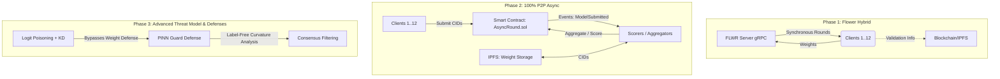

# Comprehensive Evolution Report: UnifyFL Architectural & Threat Model Transitions

This document provides an in-depth chronological summary of the architectural transformations, core technical decisions, refactors, and threat model transitions implemented in the UnifyFL framework—ranging from the original synchronous Flower-based setup under Gaussian noise attacks to the current fully decentralized, asynchronous, peer-to-peer (P2P) network defended by label-free PINN Guard against logit-poisoning attacks.

---

## 1. Timeline of Architectural Transitions

The UnifyFL framework has evolved through three distinct phases to reconcile the requirements of decentralized trust, operational scalability, and robust security.

### Phase 1: The Original Flower-Based Hybrid Setup
*   **Orchestration:** Built on top of the Flower (`flwr`) federated learning framework.
*   **Synchrony:** Strict synchronous execution. The central Flower server coordinates rounds, waiting for a threshold of clients to submit model parameters via gRPC.
*   **Blockchain Role:** Used primarily as an immutable audit trail. Clients and scorers recorded weights (CIDs) and validation scores on-chain, but the core training synchronization and aggregation were still mediated by the centralized gRPC server.
*   **Bottlenecks & Failures:** 
    *   **Latency Mismatch:** Blockchain confirmation times (even on local testnets like Anvil or Geth) conflicted with Flower's strict gRPC timeout windows, leading to frequent client drops and round failures.
    *   **Port & Resource Collisions:** Running multiple Flower clients locally generated port binding races and socket exhaustion.
*   **Threat Model:** Simple **Gaussian Noise Poisoning**. Malicious clients added random Gaussian noise directly to the model weights before uploading.

### Phase 2: Transitioning to 100% P2P Decentralization (Bypassing Flower)
To eliminate the centralized gRPC coordinator and resolve synchronous timeout conflicts, the Flower framework was completely bypassed.
*   **State Machine:** Replaced by the `AsyncRound.sol` and `Registration.sol` smart contracts. The blockchain controls the state transition of each round.
*   **Asynchronous Loop:**
    *   **Clients:** Train local models, upload the trained weights (`.pt` files) to **IPFS**, and call `submitModel(ipfsHash)` on the smart contract.
    *   **Scorers:** Listen for the `ModelSubmitted` event on the blockchain, download the corresponding weights from IPFS, compute performance scores, and record them on-chain via `submitScore()`.
    *   **Aggregators:** Monitor the smart contract, fetch the top-scoring client updates, download the weights from IPFS, compute the FedAvg update, upload the new global model to IPFS, and start the next round via the smart contract.
*   **Impact:** True trustless coordination. Nodes act asynchronously, communicating solely via blockchain events and IPFS CIDs.

### Phase 3: Transitioning to Logit-Level Attacks and Knowledge Distillation (KD)
As the orchestration matured, the threat model was updated to reflect sophisticated, stealthy attacks that bypass standard weight-distance anomalies.
*   **Knowledge Distillation (KD) Integration:** Clients train student models using a combination of Cross-Entropy loss on local data and Kullback-Leibler (KL) Divergence loss against a teacher model.
*   **Logit-Poisoning Attack:** Malicious clients corrupt the logit outputs of the teacher model during KD training by adding scaled noise:
    $$\tilde{z} = z + \alpha \cdot \epsilon, \quad \epsilon \sim \mathcal{N}(0, \sigma^2)$$
    The student model is then distilled using these poisoned logits.
*   **Stealth Nature:** Because the weights are updated via KD optimization, they lie within a normal parameter distribution, bypassing geometric defenses like Multi-Krum or coordinate-median filtering. However, the model's decision boundaries are corrupted, causing sudden performance degradation (model collapse) upon aggregation.

---

## 2. Core Strategic Decisions & Refactors

Throughout the development lifecycle, several major architectural and configuration issues were resolved:

### Decision 1: Resolving Transaction & Nonce Collisions (Account Offsetting)
*   **The Problem:** Clients, scorers, and aggregators were initially mapped to overlapping Ethereum addresses on the local Anvil testnet. Simultaneous transaction submissions resulted in invalid transaction nonces, transaction reversion, and deadlocks.
*   **The Refactor:**
    *   Aggregators and Scorers are mapped to **Account 0** (and Accounts $N+1$ if multiple).
    *   Clients are mapped dynamically to **Accounts 1 to N** based on their 1-indexed Client ID.
    *   Initialized Anvil with 20 accounts (`anvil -a 20`) to prevent out-of-bounds index errors.
    *   Ensured client and aggregator configuration objects cleanly reference their unique private keys and addresses.

### Decision 2: Distinguishing Client Updates from Aggregator Models
*   **The Problem:** The aggregator loop continuously monitors `ModelSubmitted` events. Without strict account checking, the aggregator would mistake its own newly submitted global model updates for client updates, polluting the aggregation pool and leading to infinite aggregation loops.
*   **The Refactor:**
    *   Aggregators verify the transaction sender (`tx_sender`) of each `ModelSubmitted` event.
    *   Only submissions originating from registered client addresses (Accounts 1 to N) are gathered for validation and aggregation.

### Decision 3: Standardizing Client Count to 12
*   **The Problem:** To speed up debugging, the network was temporarily configured to run with 10 clients. However, the original non-IID data-splitting pipeline (`prepare_cifar10.sh`) partitions the CIFAR-10 dataset into exactly 12 directories (`train0` to `train11`). Scaling down to 10 clients caused file path mismatches and failed worker starts.
*   **The Refactor:**
    *   Standardized the simulation to **12 total clients** (10 benign, 2 malicious).
    *   This preserves the original data distribution properties and ensures client $i$ maps to dataset `train[i-1]`.

### Decision 4: Single-Aggregator Local Simulation
*   **The Problem:** The `triple-threat-dind` branch introduced multiple concurrent aggregators in Docker containers to prove aggregator consensus. However, running multiple Docker containers locally added immense resource usage, slow execution, and complex logging.
*   **The Refactor:**
    *   Kept the P2P Async architecture but configured the simulation to run with **1 primary aggregator / scorer process** (running on Account 0). This drastically speeds up execution while leaving the underlying multi-aggregator smart contract support intact.

---

## 3. Comparative Summary of System Configurations

| Feature | Original Setup (Phase 1) | Current Setup (Phase 3) |
| :--- | :--- | :--- |
| **Orchestration Layer** | Centralized Flower Server (`gRPC`) | Decentralized Smart Contract (`AsyncRound.sol`) + IPFS |
| **Execution Mode** | Synchronous round-by-round | Asynchronous event-driven |
| **Network Scaling** | 12 clients | 12 clients (10 benign + 2 malicious) |
| **Scoring Mechanics** | Labeled Validation Accuracy | Label-Free PINN Guard (Logit Curvature Analysis) |
| **Aggregator Model** | Single gRPC Aggregator | Single Local Aggregator (Account 0, contract-driven) |
| **Attack Vector** | Parameter-level Gaussian Noise | Logit-level Poisoning with Knowledge Distillation |
| **Dataset Distribution** | Non-IID Dirichlet distribution | Non-IID Dirichlet distribution |

---

## 4. The PINN Guard Defense System

In a production federated learning setup, scorer nodes lack access to private client training data or labeled validation sets due to privacy restrictions.

### How PINN Guard Works
PINN Guard replaces standard label-based accuracy scoring with a **curvature-based anomaly detection metric**:
1.  **Input:** Unlabeled validation data is passed through the submitted client model.
2.  **Curvature Calculation:** PINN Guard computes the Laplacian trace (curvature) of the output logits with respect to the input features.
3.  **Anomaly Detection:** Poisoned models exhibit anomalous logit curvature characteristics (either highly unstable or artificially smoothed due to noise injection) compared to benign models.
4.  **Decisions:** Scorer nodes rate the submission based on this curvature metric, and the aggregator filters out low-scoring updates, preserving global model integrity without needing labeled validation samples.

---

## 5. Demo Presentation Outline (Slides)

### Slide 1: Title Slide
* **Title:** UnifyFL: Decentralized P2P Federated Learning & Stealth Threat Defenses
* **Subtitle:** Securing Asynchronous FL Networks via Smart Contracts & PINN Guard

### Slide 2: The Architectural Evolution
* **Phase 1: Flower Hybrid**: Centralized gRPC-based synchronous rounds. Blockchains used purely for auditing. Encountered latency and timeout issues.
* **Phase 2: 100% P2P Asynchronous Loop**: Decentralized control via smart contracts (`AsyncRound.sol`) & IPFS storage. Eliminates centralized timeouts.
* **Phase 3: Advanced Threats**: Transitioned from Gaussian parameter noise to stealthy **Logit Poisoning** through Knowledge Distillation.

### Slide 3: Core Technical Decisions & Refactors
* **Ethereum Account Offsetting**: Fixed nonce collisions by mapping Aggregators/Scorers to Account 0 and Clients to Accounts 1–12 (via `anvil -a 20`).
* **Sender Validation**: Prevented infinite loops by validating `tx_sender` to ignore aggregator-submitted global models in the client update pool.
* **Single Aggregator Simulation**: Scaled down resource footprint locally while maintaining multi-aggregator smart contract support.

### Slide 4: Stealth Threat Model: Logit Poisoning & KD
* **Mechanism**: Malicious clients poison logits ($z + \alpha \cdot \epsilon$) on teacher models during Knowledge Distillation.
* **Stealth factor**: Bypasses distance-based or parameter-based filters (Multi-Krum) because distilled weights lie within a normal distribution range.

### Slide 5: The Defense: Label-Free PINN Guard
* **Laplacian Trace Curvature**: Calculates logit curvature anomalies on unlabeled data.
* **Consensus Scoring**: Pinpoints anomalous models and enables scoring nodes to flag logit-poisoned submissions without requiring private client labels.

### Slide 6: Live Progress Checkpoint
* **Execution**: Running a 100-round pipeline using `run_logit_poisoning_pinn.sh`.
* **State**: Active and training stably in the background (Account-offset clients + primary contract-driven aggregator/scorer).

